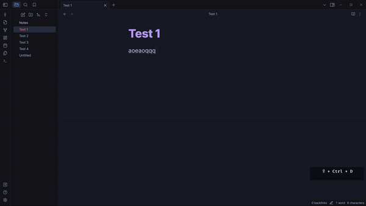

# Obsidian Harpoon Plugin

An Obsidian plugin to manage and quickly navigate to your favorite files.
This is a port of Harpoon (github.com/theprimeagen/harpoon) plugin for Obsidian.

### Installation

Note: This assumes that you're already familiar with installing Obsidian plugins.

* Download the Harpoon Plugin
* Install it in your Obsidian vault as you would with any other plugin.

### Inital Setup

I recommend for you to use your favorite keybindings to add/navigate files.
After installation, the plugin will create a default configuration file named harpoon-config.json in your vault.

### Usage

* Open File List: This command opens a modal that lists the files you've hooked with Harpoon.
* Add File to List: Add the currently active file to the Harpoon list. Note: There's a limit of 4 files that can be added.
* Go To File: You can use one of the Go To File x commands (where x is a number from 1 to 4) to quickly jump to one of your hooked files.

### Keyboard Shortcuts

> Ctrl + Shift + D: Opens the modal.

While the Harpoon modal is open:

**Ctrl + Shift + D**: Close the modal.

**Enter**: Choose the file corresponding to the currently highlighted index.

**dd**: Quickly press twice to remove a file from the list.

**p**: Insert the last removed file just after the currently highlighted file.

**Shift + p**: Insert the last removed file just before the currently highlighted file

**ArrowDown or J**: Navigate downwards in the list.
**ArrowUp or K**: Navigate upwards in the list.

### Tips

* Make sure not to manually delete the harpoon-config.json unless you're sure about it. It holds the configuration and list of hooked files for the plugin.
* The plugin is designed for quick navigation, so make use of keyboard shortcuts for efficient usage.

## Todos

[ ] Add scroll to pos (includes on initial load/refresh)
[ ] Add adjustable keybindings for Harpoon Modal? (maybe)
